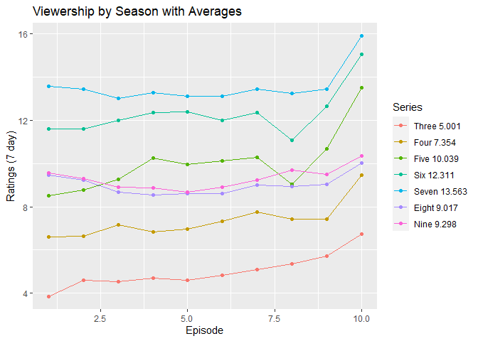

```r
library(tidyverse)
```

```
## -- Attaching packages ----------------------------------------------- tidyverse 1.3.0 --
```

```
## v ggplot2 3.3.2     v purrr   0.3.4
## v tibble  3.0.2     v dplyr   1.0.0
## v tidyr   1.1.0     v stringr 1.4.0
## v readr   1.3.1     v forcats 0.5.0
```

```
## -- Conflicts -------------------------------------------------- tidyverse_conflicts() --
## x dplyr::filter() masks stats::filter()
## x dplyr::lag()    masks stats::lag()
```

```r
library(bakeoff)
library(mosaic)
```

```
## Loading required package: lattice
```

```
## Loading required package: ggformula
```

```
## Loading required package: ggstance
```

```
## 
## Attaching package: 'ggstance'
```

```
## The following objects are masked from 'package:ggplot2':
## 
##     geom_errorbarh, GeomErrorbarh
```

```
## 
## New to ggformula?  Try the tutorials: 
## 	learnr::run_tutorial("introduction", package = "ggformula")
## 	learnr::run_tutorial("refining", package = "ggformula")
```

```
## Loading required package: mosaicData
```

```
## Loading required package: Matrix
```

```
## 
## Attaching package: 'Matrix'
```

```
## The following objects are masked from 'package:tidyr':
## 
##     expand, pack, unpack
```

```
## Registered S3 method overwritten by 'mosaic':
##   method                           from   
##   fortify.SpatialPolygonsDataFrame ggplot2
```

```
## 
## The 'mosaic' package masks several functions from core packages in order to add 
## additional features.  The original behavior of these functions should not be affected by this.
## 
## Note: If you use the Matrix package, be sure to load it BEFORE loading mosaic.
## 
## Have you tried the ggformula package for your plots?
```

```
## 
## Attaching package: 'mosaic'
```

```
## The following object is masked from 'package:Matrix':
## 
##     mean
```

```
## The following objects are masked from 'package:dplyr':
## 
##     count, do, tally
```

```
## The following object is masked from 'package:purrr':
## 
##     cross
```

```
## The following object is masked from 'package:ggplot2':
## 
##     stat
```

```
## The following objects are masked from 'package:stats':
## 
##     binom.test, cor, cor.test, cov, fivenum, IQR, median, prop.test,
##     quantile, sd, t.test, var
```

```
## The following objects are masked from 'package:base':
## 
##     max, mean, min, prod, range, sample, sum
```

Here is my commentary of the code asked for:


```r
only_first_last <- ratings %>% # creates a new dataset by manipulating ratings
  group_by(series) %>% # puts the data in groups by season
  slice(1, n()) %>% # cuts away every episodes except for the first and last episode
  mutate(which_episode = ifelse(episode == 1, "First", "Last")) %>% # creates a new variable to rename the first and last episodes as characters rather than numbers.
  ungroup() %>% 
  mutate(series_f = as.factor(series)) # creates a new variable that is the same as series but in a factor form rather than a character form

View(only_first_last) #looks at the data set in a new window

ggplot(data = only_first_last, 
       mapping = aes(x = which_episode, 
                     y = viewers_7day, 
                     group = series_f,
                     color = series_f)) +
  geom_line() +
  geom_point(size = 5) #creates a line graph with points superimposed to compare viewship of first episodes vs last episodes.
```

<!-- -->

Here is the graphic asked for


```r
R2 <- ratings %>%
  group_by(series) %>%
  filter(n() == 10)

v <- mean(R2$viewers_7day ~ as.factor(R2$series))

v2 <- c("Three 5.001", "Four 7.354", "Five 10.039", "Six 12.311", "Seven 13.563",
        "Eight 9.017", "Nine 9.298")

ggplot(data = R2, aes(x = episode, y = viewers_7day, group = series,
                      color = as.factor(series))) +
  geom_line() +
  geom_point() + 
  scale_color_discrete(name = "Series", labels = v2) +
  ggtitle("Viewership by Season with Averages") +
  xlab("Episode") +
  ylab("Ratings (7 day)")
```

<!-- -->

WE can see that the viewership increased with each season up until season 7, where it dropped off pretty dramatically. We also notice that every season experiences a spike for the final episode or sometimes two.
