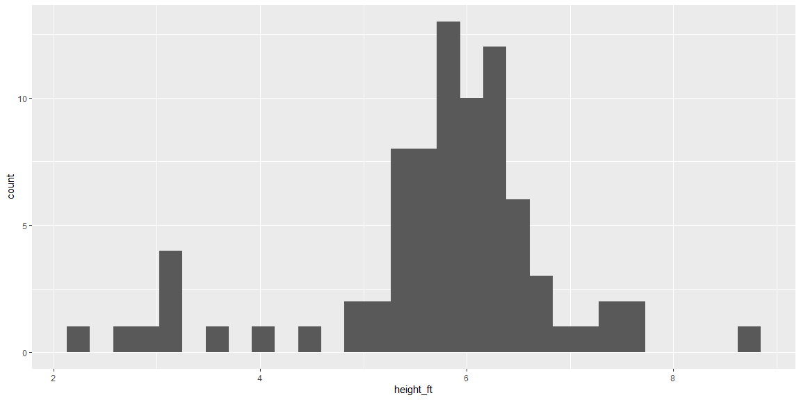
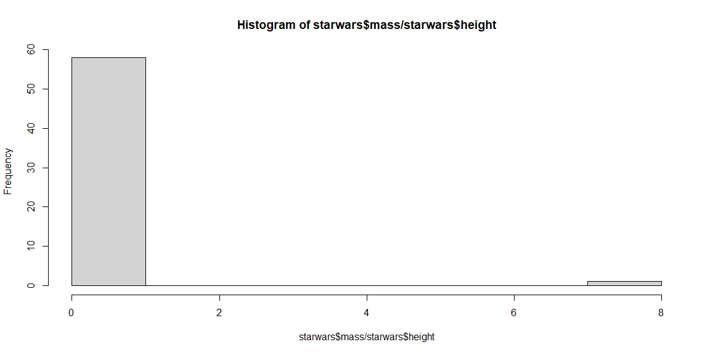

## Reading Notes

2 Key questions: Ask about variation and covariation

Visualization is a good place to start. Categorical or quantitative?

Consider geom_freqpoly for layered graphs

Search for both  typical and unusual values

## EDA Example

The code below is an example of the EDA process using the `starwars` data from the `tidyverse` package. (Make sure you have the `tidyverse` package installed!)

Run the code line-by-line and look at the output. Add a comment to each line of code that explains what it does/what insights it provides.


```r
library(tidyverse)
# Adds the tidyverse library to use functions saved there.

dim(starwars) #Gives the dimensions of starwars data
```

```
## [1] 87 14
```

```r
colnames(starwars) #Gives the names of the columns of starwars
```

```
##  [1] "name"       "height"     "mass"       "hair_color" "skin_color"
##  [6] "eye_color"  "birth_year" "sex"        "gender"     "homeworld" 
## [11] "species"    "films"      "vehicles"   "starships"
```

```r
head(starwars) #Shows you the first bit of data at the beginning of the tables
```

```
## Warning: `...` is not empty.
## 
## We detected these problematic arguments:
## * `needs_dots`
## 
## These dots only exist to allow future extensions and should be empty.
## Did you misspecify an argument?
```

```
## # A tibble: 6 x 14
##   name  height  mass hair_color skin_color eye_color birth_year sex   gender
##   <chr>  <int> <dbl> <chr>      <chr>      <chr>          <dbl> <chr> <chr> 
## 1 Luke~    172    77 blond      fair       blue            19   male  mascu~
## 2 C-3PO    167    75 <NA>       gold       yellow         112   none  mascu~
## 3 R2-D2     96    32 <NA>       white, bl~ red             33   none  mascu~
## 4 Dart~    202   136 none       white      yellow          41.9 male  mascu~
## 5 Leia~    150    49 brown      light      brown           19   fema~ femin~
## 6 Owen~    178   120 brown, gr~ light      blue            52   male  mascu~
## # ... with 5 more variables: homeworld <chr>, species <chr>, films <list>,
## #   vehicles <list>, starships <list>
```

```r
glimpse(starwars) #Glimpse is like head but shows the data in a different format
```

```
## Rows: 87
## Columns: 14
## $ name       <chr> "Luke Skywalker", "C-3PO", "R2-D2", "Darth Vader", "Leia...
## $ height     <int> 172, 167, 96, 202, 150, 178, 165, 97, 183, 182, 188, 180...
## $ mass       <dbl> 77.0, 75.0, 32.0, 136.0, 49.0, 120.0, 75.0, 32.0, 84.0, ...
## $ hair_color <chr> "blond", NA, NA, "none", "brown", "brown, grey", "brown"...
## $ skin_color <chr> "fair", "gold", "white, blue", "white", "light", "light"...
## $ eye_color  <chr> "blue", "yellow", "red", "yellow", "brown", "blue", "blu...
## $ birth_year <dbl> 19.0, 112.0, 33.0, 41.9, 19.0, 52.0, 47.0, NA, 24.0, 57....
## $ sex        <chr> "male", "none", "none", "male", "female", "male", "femal...
## $ gender     <chr> "masculine", "masculine", "masculine", "masculine", "fem...
## $ homeworld  <chr> "Tatooine", "Tatooine", "Naboo", "Tatooine", "Alderaan",...
## $ species    <chr> "Human", "Droid", "Droid", "Human", "Human", "Human", "H...
## $ films      <list> [<"The Empire Strikes Back", "Revenge of the Sith", "Re...
## $ vehicles   <list> [<"Snowspeeder", "Imperial Speeder Bike">, <>, <>, <>, ...
## $ starships  <list> [<"X-wing", "Imperial shuttle">, <>, <>, "TIE Advanced ...
```

```r
?starwars #Shows the help file about the starwars data

starwars %>% count(species) #Pipes starwars data into the count function which counts the species
```

```
## Warning: `...` is not empty.
## 
## We detected these problematic arguments:
## * `needs_dots`
## 
## These dots only exist to allow future extensions and should be empty.
## Did you misspecify an argument?
```

```
## # A tibble: 38 x 2
##    species       n
##    <chr>     <int>
##  1 Aleena        1
##  2 Besalisk      1
##  3 Cerean        1
##  4 Chagrian      1
##  5 Clawdite      1
##  6 Droid         6
##  7 Dug           1
##  8 Ewok          1
##  9 Geonosian     1
## 10 Gungan        3
## # ... with 28 more rows
```

```r
mean(starwars$height) #gives the mean of the height column in the starwars data
```

```
## [1] NA
```

```r
mean(starwars$height, na.rm = TRUE) #Ignores NA values to do the same as above in spite of NA's included.
```

```
## [1] 174.358
```

```r
summary(starwars$height) #Shows a summary of commonly sought statistics about the starwars height vector
```

```
##    Min. 1st Qu.  Median    Mean 3rd Qu.    Max.    NA's 
##    66.0   167.0   180.0   174.4   191.0   264.0       6
```

```r
cm_to_ft <- function(cm){
  ft = cm / 30.48
  return(ft)
} #Creates a function that converts cm to ft

starwars_2 <- starwars %>% mutate(height_ft = cm_to_ft(height)) #converts height of starwars characters to ft instead of cm and stors it in a new copy of the dataset. 

dim(starwars_2) #Retrieves dimentions of starwars 2 data
```

```
## [1] 87 15
```

```r
colnames(starwars_2) #Retrieves the column names of starwars 2 data
```

```
##  [1] "name"       "height"     "mass"       "hair_color" "skin_color"
##  [6] "eye_color"  "birth_year" "sex"        "gender"     "homeworld" 
## [11] "species"    "films"      "vehicles"   "starships"  "height_ft"
```

```r
summary(starwars_2$height_ft) #Shows a summary of the hight data in ft in star wars 2 data
```

```
##    Min. 1st Qu.  Median    Mean 3rd Qu.    Max.    NA's 
##   2.165   5.479   5.906   5.720   6.266   8.661       6
```

```r
ggplot(starwars_2, aes(height_ft)) + 
  geom_histogram() #creates a histogram of heights in feet from star wars 2 data
```

```
## Warning: Removed 6 rows containing non-finite values (stat_bin).
```

<!-- -->

```r
starwars_2 %>% filter(height_ft == max(height_ft)) #filters the data for only the very tallest characters, including ties
```

```
## Warning: `...` is not empty.
## 
## We detected these problematic arguments:
## * `needs_dots`
## 
## These dots only exist to allow future extensions and should be empty.
## Did you misspecify an argument?
```

```
## # A tibble: 0 x 15
## # ... with 15 variables: name <chr>, height <int>, mass <dbl>,
## #   hair_color <chr>, skin_color <chr>, eye_color <chr>, birth_year <dbl>,
## #   sex <chr>, gender <chr>, homeworld <chr>, species <chr>, films <list>,
## #   vehicles <list>, starships <list>, height_ft <dbl>
```

```r
starwars_2 %>% filter(height_ft == max(height_ft, na.rm = TRUE)) #Does the same but accounts for NA's that would otherwise stop the function from running.
```

```
## Warning: `...` is not empty.
## 
## We detected these problematic arguments:
## * `needs_dots`
## 
## These dots only exist to allow future extensions and should be empty.
## Did you misspecify an argument?
```

```
## # A tibble: 1 x 15
##   name  height  mass hair_color skin_color eye_color birth_year sex   gender
##   <chr>  <int> <dbl> <chr>      <chr>      <chr>          <dbl> <chr> <chr> 
## 1 Yara~    264    NA none       white      yellow            NA male  mascu~
## # ... with 6 more variables: homeworld <chr>, species <chr>, films <list>,
## #   vehicles <list>, starships <list>, height_ft <dbl>
```

```r
# https://starwars.fandom.com/wiki/Yarael_Poof
```

## EDA Practice

Continue exploring the `starwars` data to gain additional insights, using [R4DS: Chapter 7](https://r4ds.had.co.nz/exploratory-data-analysis.html) as a guide.

It is ok if you don't understand the all code in Chapter 7. (That is what we'll be learning the next two weeks!) If writing your own code is a struggle, try the "copy, paste, and tweak" method.


```r
view(starwars)
library(mosaic)
favstats(mass/height ~ sex, data = starwars)
```

```
##              sex       min        Q1    median        Q3       max      mean
## 1         female 0.2717391 0.3012048 0.3202247 0.3273810 0.4545455 0.3237851
## 2 hermaphroditic 7.7600000 7.7600000 7.7600000 7.7600000 7.7600000 7.7600000
## 3           male 0.1898734 0.4144162 0.4441610 0.4611183 0.7361111 0.4442594
## 4           none 0.3298969 0.3324742 0.3912176 0.5118263 0.7000000 0.4530830
##           sd  n missing
## 1 0.05387828  9       7
## 2         NA  1       0
## 3 0.10712499 44      16
## 4 0.17368425  4       2
```

```r
#Here I wanted to compare mass and height for some correlation about density. I divided it by sex because men and women I might expect to have different values. Hermaphroditic characters seem to have very large mass compared to their height.

hist(starwars$mass/starwars$height)
```

<!-- -->

```r
#This histogram helps clarify, there are many characters in the lower range, while only a few at such a high range like the hermaphroditic characters, we can assume that outliers in density match the rare hermaphroditic character type.
```
