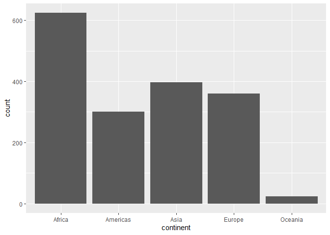

```r
library(gapminder)
library(ggplot2)
library(tidyverse)
```

```
## -- Attaching packages ----------------------------------------------- tidyverse 1.3.0 --
```

```
## v tibble  3.0.2     v dplyr   1.0.0
## v tidyr   1.1.0     v stringr 1.4.0
## v readr   1.3.1     v forcats 0.5.0
## v purrr   0.3.4
```

```
## -- Conflicts -------------------------------------------------- tidyverse_conflicts() --
## x dplyr::filter() masks stats::filter()
## x dplyr::lag()    masks stats::lag()
```

```r
ggplot(data = gapminder, aes(lifeExp)) + 
  geom_boxplot()
```

<!-- -->

Here we can easily visualize the spread of the distribution and see where it is centered.


```r
ggplot(gapminder, aes(continent)) +
  geom_bar()
```

<!-- -->

Here we can see the count of observations on each continent. This is useful because as we do other analysis we are going to see we know that Oceana might not be as normal as others, since that small count will leave grouped analyses vulnerable to outliers.


```r
ggplot(gapminder, aes(lifeExp, continent)) +
  geom_boxplot()
```

<!-- -->

This is a simple breakdown of combining more or less the last two graphs, now you can see and compare distributions from different continents and see easliy how they stack against each other.


```r
gap <- filter(gapminder, country != "Kuwait")
ggplot(gap, aes(lifeExp, gdpPercap, size = pop/100000, color = continent)) + 
  geom_point() +
  facet_grid(cols = vars(year)) +
  guides(size = guide_legend(order = 1),
         color = guide_legend(order = 2)) +
  labs(size = "Population (100K",
       color = "Continent") +
  xlab("Life Expentancy") +
  ylab("GDP per Capita") +
  scale_y_continuous(trans = "sqrt")
```

<!-- -->

```r
ggsave("graph.png")
```

```
## Saving 7 x 5 in image
```


