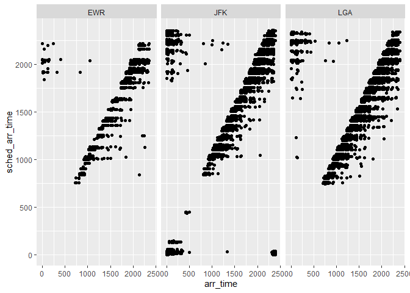

```r
library(nycflights13)
library(tidyverse)
library(mosaic)
library(pander)
```

# Question 1:

### Which origin airport is best to minimize my chances of a late arrival when I am using Delta Airlines?


```r
del <- filter(flights, carrier == "DL")
pander(mean(del$arr_delay ~ del$origin, na.rm = TRUE))
```


-----------------------
 EWR     JFK      LGA  
------ -------- -------
 8.78   -2.379   3.928 
-----------------------

```r
ggplot(del) +
  geom_point(aes(x = arr_time, y = sched_arr_time)) +
  facet_grid(cols = vars(origin))
```

<!-- -->

This simple table gives the average delay of arrival from each airport for delta planes. Because the delay time is set as a positive number, the negative actually means that delta flights that originate from JFK on average arrive early, so that would be the best airport to choose.

# Question 2:

## Which destination airport is the worst airport for arrival time? (you decide on the metric for "worst")


```r
list <- data.frame(mean(flights$arr_delay ~ del$dest, na.rm = TRUE))
list <- list %>%
  rename(average = mean.flights.arr_delay...del.dest..na.rm...TRUE.,)
pander(filter(list, list$average == max((list$average))))
```


-------------------
 &nbsp;    average 
--------- ---------
 **STL**    32.71  
-------------------

STL airport has on average the latest arrival times so that would be the worst airport.

