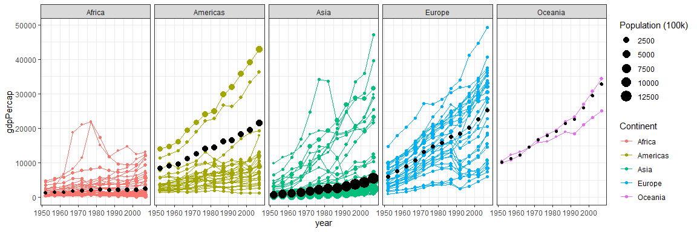

```r
library(tidyverse)
```

```
-- Attaching packages ----------------------------------------------- tidyverse 1.3.0 --
```

```
v ggplot2 3.3.2     v purrr   0.3.4
v tibble  3.0.2     v dplyr   1.0.0
v tidyr   1.1.0     v stringr 1.4.0
v readr   1.3.1     v forcats 0.5.0
```

```
-- Conflicts -------------------------------------------------- tidyverse_conflicts() --
x dplyr::filter() masks stats::filter()
x dplyr::lag()    masks stats::lag()
```

```r
library(mosaic)
```

```
Loading required package: lattice
```

```
Loading required package: ggformula
```

```
Loading required package: ggstance
```

```

Attaching package: 'ggstance'
```

```
The following objects are masked from 'package:ggplot2':

    geom_errorbarh, GeomErrorbarh
```

```

New to ggformula?  Try the tutorials: 
	learnr::run_tutorial("introduction", package = "ggformula")
	learnr::run_tutorial("refining", package = "ggformula")
```

```
Loading required package: mosaicData
```

```
Loading required package: Matrix
```

```

Attaching package: 'Matrix'
```

```
The following objects are masked from 'package:tidyr':

    expand, pack, unpack
```

```
Registered S3 method overwritten by 'mosaic':
  method                           from   
  fortify.SpatialPolygonsDataFrame ggplot2
```

```

The 'mosaic' package masks several functions from core packages in order to add 
additional features.  The original behavior of these functions should not be affected by this.

Note: If you use the Matrix package, be sure to load it BEFORE loading mosaic.

Have you tried the ggformula package for your plots?
```

```

Attaching package: 'mosaic'
```

```
The following object is masked from 'package:Matrix':

    mean
```

```
The following objects are masked from 'package:dplyr':

    count, do, tally
```

```
The following object is masked from 'package:purrr':

    cross
```

```
The following object is masked from 'package:ggplot2':

    stat
```

```
The following objects are masked from 'package:stats':

    binom.test, cor, cor.test, cov, fivenum, IQR, median, prop.test,
    quantile, sd, t.test, var
```

```
The following objects are masked from 'package:base':

    max, mean, min, prod, range, sample, sum
```

```r
library(gapminder)
```


```r
gap <- gapminder %>%
  filter(country != "Kuwait") %>%
  group_by(year, continent) %>%
  mutate(w_mean = weighted.mean(weighted.mean(gdpPercap, pop/100000)))

ggplot(gap) +
  geom_point(aes(x = year, 
                 y = gdpPercap, 
                 color = continent, 
                 group = country,
                 size = pop/100000)) +
  geom_line(aes(x = year, 
                y = gdpPercap,
                color = continent, 
                group = country)) +
  geom_point(aes(x = year, 
                 y = w_mean,
                 size = pop/100000)) +
  facet_grid(cols = vars(continent)) +
  scale_size(name = "Population (100k)") +
  scale_color_discrete(name = "Continent") +
  theme_bw()
```

<!-- -->

