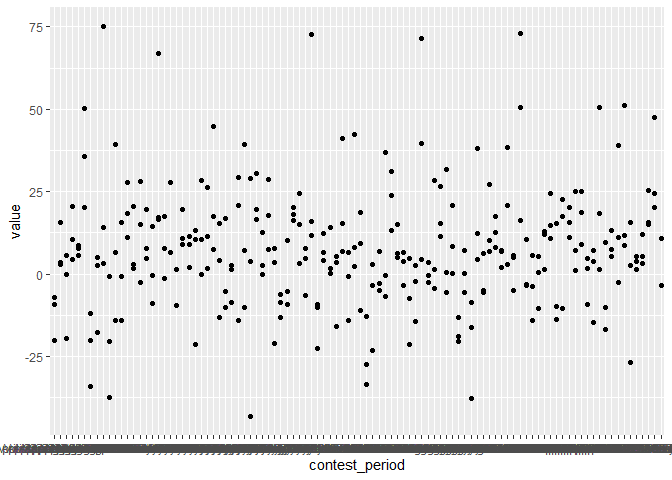

```r
library(tidyverse)
```

```
## -- Attaching packages --------------------------------------------------------------------------- tidyverse 1.3.0 --
```

```
## v ggplot2 3.3.2     v purrr   0.3.4
## v tibble  3.0.2     v dplyr   1.0.0
## v tidyr   1.1.0     v stringr 1.4.0
## v readr   1.3.1     v forcats 0.5.0
```

```
## -- Conflicts ------------------------------------------------------------------------------ tidyverse_conflicts() --
## x dplyr::filter() masks stats::filter()
## x dplyr::lag()    masks stats::lag()
```

```r
library(readr)
library(mosaic)
```

```
## Loading required package: lattice
```

```
## Loading required package: ggformula
```

```
## Loading required package: ggstance
```

```
## 
## Attaching package: 'ggstance'
```

```
## The following objects are masked from 'package:ggplot2':
## 
##     geom_errorbarh, GeomErrorbarh
```

```
## 
## New to ggformula?  Try the tutorials: 
## 	learnr::run_tutorial("introduction", package = "ggformula")
## 	learnr::run_tutorial("refining", package = "ggformula")
```

```
## Loading required package: mosaicData
```

```
## Loading required package: Matrix
```

```
## 
## Attaching package: 'Matrix'
```

```
## The following objects are masked from 'package:tidyr':
## 
##     expand, pack, unpack
```

```
## Registered S3 method overwritten by 'mosaic':
##   method                           from   
##   fortify.SpatialPolygonsDataFrame ggplot2
```

```
## 
## The 'mosaic' package masks several functions from core packages in order to add 
## additional features.  The original behavior of these functions should not be affected by this.
## 
## Note: If you use the Matrix package, be sure to load it BEFORE loading mosaic.
## 
## Have you tried the ggformula package for your plots?
```

```
## 
## Attaching package: 'mosaic'
```

```
## The following object is masked from 'package:Matrix':
## 
##     mean
```

```
## The following objects are masked from 'package:dplyr':
## 
##     count, do, tally
```

```
## The following object is masked from 'package:purrr':
## 
##     cross
```

```
## The following object is masked from 'package:ggplot2':
## 
##     stat
```

```
## The following objects are masked from 'package:stats':
## 
##     binom.test, cor, cor.test, cov, fivenum, IQR, median, prop.test,
##     quantile, sd, t.test, var
```

```
## The following objects are masked from 'package:base':
## 
##     max, mean, min, prod, range, sample, sum
```

```r
dat <- read_rds(url("https://github.com/byuistats/data/blob/master/Dart_Expert_Dow_6month_anova/Dart_Expert_Dow_6month_anova.RDS?raw=true")) 
```


```r
ggplot(dat) +
  geom_point(aes(x = contest_period, y = value))
```

<!-- -->

This is a simple plot that lays out the value of these stocks over this period, it appears that they are pretty random at first glance.


```r
stocks <- dat %>% 
   separate(contest_period, into = c("month_beg", "month_year"),  sep = "-")  %>% 
   separate(month_year, into = c("month_end", "year_end"), sep = -4) %>% 
   select(-month_beg)
```


```r
DJIA <- filter(stocks, stocks$variable == "DJIA")
```


