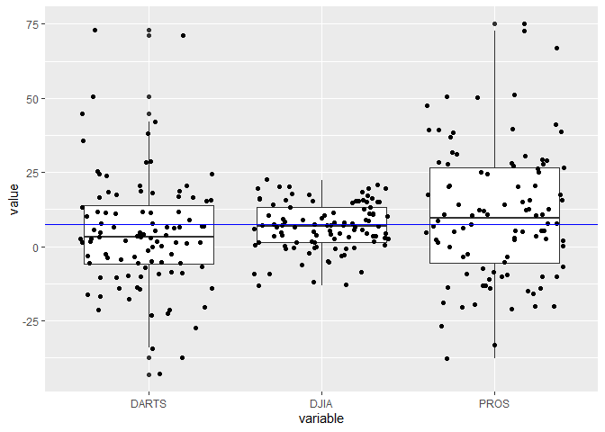

```r
library(tidyverse)
```

```
## -- Attaching packages --------------------------------------------------------------------------- tidyverse 1.3.0 --
```

```
## v ggplot2 3.3.2     v purrr   0.3.4
## v tibble  3.0.2     v dplyr   1.0.0
## v tidyr   1.1.0     v stringr 1.4.0
## v readr   1.3.1     v forcats 0.5.0
```

```
## -- Conflicts ------------------------------------------------------------------------------ tidyverse_conflicts() --
## x dplyr::filter() masks stats::filter()
## x dplyr::lag()    masks stats::lag()
```

```r
library(downloader)
library(readxl)
library(readr)
library(haven)

url_sav <- "https://github.com/byuistats/data/blob/master/Dart_Expert_Dow_6month_anova/Dart_Expert_Dow_6month_anova.sav?raw=true"
url_xlsx <- "https://github.com/byuistats/data/blob/master/Dart_Expert_Dow_6month_anova/Dart_Expert_Dow_6month_anova.xlsx?raw=true"
url_RDS <- "https://github.com/byuistats/data/blob/master/Dart_Expert_Dow_6month_anova/Dart_Expert_Dow_6month_anova.RDS?raw=true"
url_dta <- "https://github.com/byuistats/data/blob/master/Dart_Expert_Dow_6month_anova/Dart_Expert_Dow_6month_anova.dta?raw=true"
url_csv <- "https://github.com/byuistats/data/blob/master/Dart_Expert_Dow_6month_anova/Dart_Expert_Dow_6month_anova.csv?raw=true"
temp <- tempfile()
download(url_xlsx, destfile = temp, mode = "wb")
dat1 <- read_xlsx(temp)
temp <- tempfile()
download(url_sav, destfile = temp, mode = "wb")
dat2 <- read_sav(temp)
temp <- tempfile()
download(url_RDS, destfile = temp, mode = "wb")
dat3 <- read_rds(temp)
temp <- tempfile()
download(url_dta, destfile = temp, mode = "wb")
dat4 <- read_dta(temp)
temp <- tempfile()
download(url_csv, destfile = temp, mode = "wb")
dat5 <- read_csv(temp)
```

```
## Parsed with column specification:
## cols(
##   contest_period = col_character(),
##   variable = col_character(),
##   value = col_double()
## )
```

```r
all.equal(dat1, dat2, check.attributes = FALSE)
```

```
## [1] TRUE
```

```r
all.equal(dat1, dat3, check.attributes = FALSE)
```

```
## [1] TRUE
```

```r
all.equal(dat1, dat4, check.attributes = FALSE)
```

```
## [1] TRUE
```

```r
all.equal(dat1, dat5, check.attributes = FALSE)
```

```
## [1] TRUE
```

```r
# Saving the URL's as variables to plug in was and idea from Hunter Rogers
```


```r
ggplot(data=dat5, aes(x=variable, y=value)) +
  geom_boxplot() +
  geom_jitter() +
  geom_hline(aes(yintercept = mean(value)), color = "blue")
```

<!-- -->


