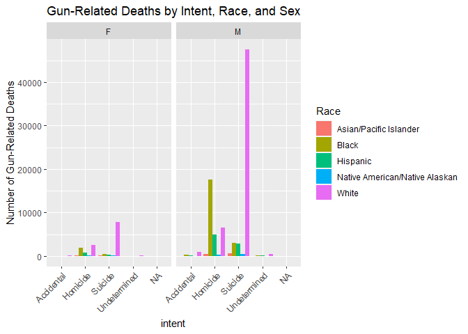
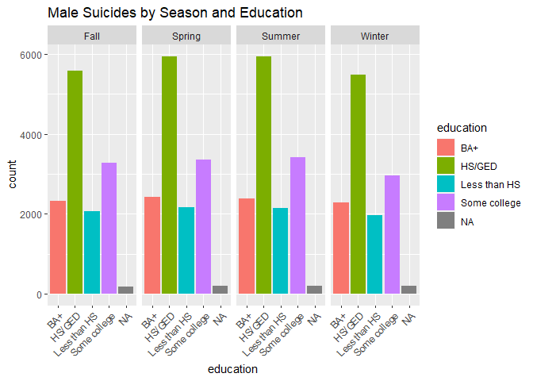
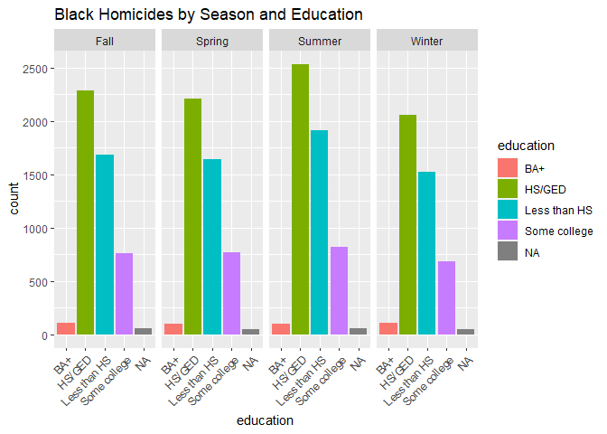
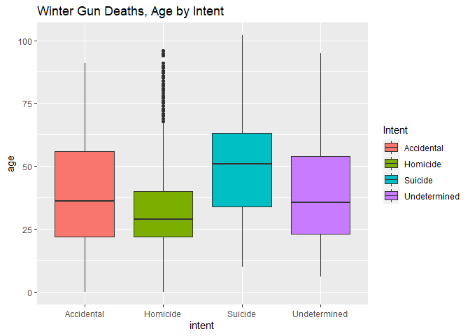

```r
#Load required Libraries
library(tidyverse)
```

```
## -- Attaching packages --------------------------------------------------------------------------- tidyverse 1.3.0 --
```

```
## v ggplot2 3.3.2     v purrr   0.3.4
## v tibble  3.0.2     v dplyr   1.0.0
## v tidyr   1.1.0     v stringr 1.4.0
## v readr   1.3.1     v forcats 0.5.0
```

```
## -- Conflicts ------------------------------------------------------------------------------ tidyverse_conflicts() --
## x dplyr::filter() masks stats::filter()
## x dplyr::lag()    masks stats::lag()
```


```r
# Read in and organize data, here adding a season column
guns <- read_csv("https://github.com/fivethirtyeight/guns-data/blob/master/full_data.csv?raw=true")
```

```
## Warning: Missing column names filled in: 'X1' [1]
```

```
## Parsed with column specification:
## cols(
##   X1 = col_double(),
##   year = col_double(),
##   month = col_character(),
##   intent = col_character(),
##   police = col_double(),
##   sex = col_character(),
##   age = col_double(),
##   race = col_character(),
##   hispanic = col_double(),
##   place = col_character(),
##   education = col_character()
## )
```

```r
guns2 <- guns %>% 
  mutate(Season = case_when(
    month %in% c("09", "10", "11") ~ "Fall",
    month %in% c("01", "02", "12") ~ "Winter",
    month %in% c("03", "04", "05") ~ "Spring",
    month %in% c("06", "07", "08") ~ "Summer"))
```


## Background

Often we tend to lump all kinds of gun deaths together when considering the subject, but the fact of the matter is that there are many different kinds of deaths with guns that happen for many different reasons, a large number (about two thirds) are are suicides, which are stacked with mostly males. While most of the one third left are civilian homicides, these figures are worth studying how they break down by race and gender.


```r
ggplot(guns2) +
  geom_bar(aes(x = intent, fill = race), position = 'dodge') + 
  facet_grid(cols = vars(sex)) + 
  theme(axis.text.x = element_text(angle = 45, vjust = 1, hjust=1)) +
  labs(title = "Gun-Related Deaths by Intent, Race, and Sex",fill = "Race") +
  ylab("Number of Gun-Related Deaths")
```

<!-- -->

We can see here that to prevent gun deaths the top 3 categories to target, based on this breakdown of categories, is first white male suicides, second is black male homicides, and third is white female suicides.

## Seasonal Trends

In order to properly target these categories, we will want to know when these types of deaths are ocurring.


```r
guns2 %>%
  filter(intent == "Suicide") %>%
  filter(sex == "M") %>%
  ggplot() + 
    geom_bar(aes(x = education, fill = education)) +
    facet_grid(cols = vars(Season)) +
    theme(axis.text.x = element_text(angle = 45, vjust = 1, hjust=1)) +
    ggtitle("Male Suicides by Season and Education")
```

<!-- -->

It is worth noting that spring and summer actually seem to be slightly higher. One might expect that seasonal affective disorder and higher depression rates during the winter would play into that being consistently higher, but that doesn't appear to be true. We can also break down that by education largely those who stopped at a high school graduation, or maybe started and didn't finish college, are at risk. Any advertising campaign might want to consider that in their choice of media.


```r
guns2 %>%
  filter(intent == "Homicide") %>%
  filter(race == "Black") %>%
  ggplot() + 
    geom_bar(aes(x = education, fill = education)) +
    facet_grid(cols = vars(Season)) +
    theme(axis.text.x = element_text(angle = 45, vjust = 1, hjust=1)) +
    ggtitle("Black Homicides by Season and Education")
```

<!-- -->

Looking at a similar graph for black homicides, we do soo that they also maintain the spike in the summertime, so that is definitively the key time to target either type of gun deaths.


```r
guns2 %>%
  filter(Season == "Winter") %>%
  ggplot() +
  geom_boxplot(aes(x = intent, y = age, fill = intent)) +
  ggtitle("Winter Gun Deaths, Age by Intent") +
  labs(fill = "Intent")
```

```
## Warning: Removed 6 rows containing non-finite values (stat_boxplot).
```

<!-- -->

If we are going to run adds during the Winter, we can here see which age groups are at the highest risk. Homicides are clearly a young person's risk, any of the older homicides are clearly variables. So anything done to target homicides should be put in media that will be seen by younger people, while prevention of suicide can be targeted to older people for a greater effect.
