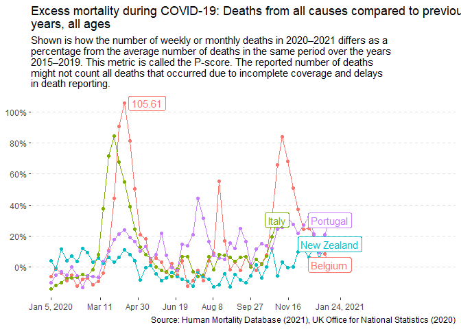
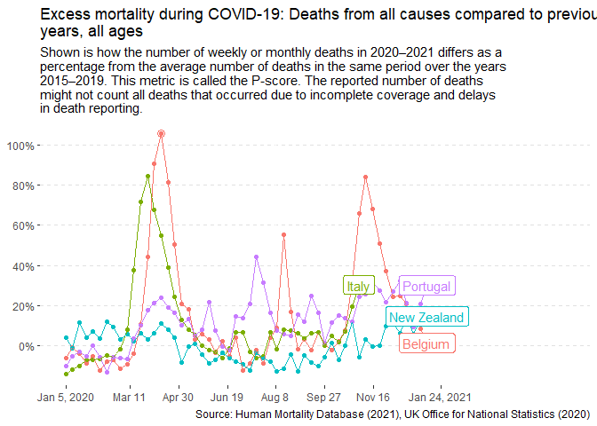
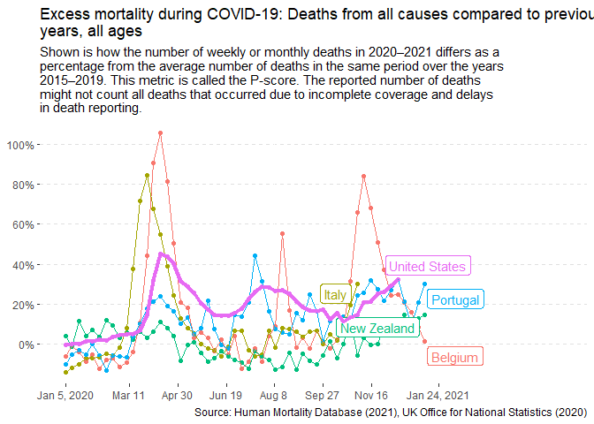
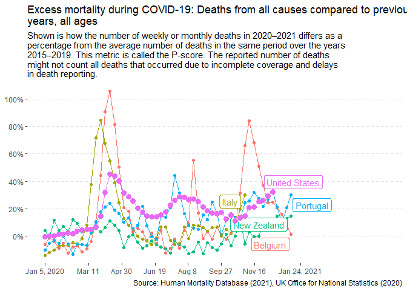

```r
library(tidyverse)
```

```
## -- Attaching packages --------------------------------------------------------------------------- tidyverse 1.3.0 --
```

```
## v ggplot2 3.3.2     v purrr   0.3.4
## v tibble  3.0.2     v dplyr   1.0.0
## v tidyr   1.1.0     v stringr 1.4.0
## v readr   1.3.1     v forcats 0.5.0
```

```
## -- Conflicts ------------------------------------------------------------------------------ tidyverse_conflicts() --
## x dplyr::filter() masks stats::filter()
## x dplyr::lag()    masks stats::lag()
```

```r
library(readr)
library(mosaic)
```

```
## Loading required package: lattice
```

```
## Loading required package: ggformula
```

```
## Loading required package: ggstance
```

```
## 
## Attaching package: 'ggstance'
```

```
## The following objects are masked from 'package:ggplot2':
## 
##     geom_errorbarh, GeomErrorbarh
```

```
## 
## New to ggformula?  Try the tutorials: 
## 	learnr::run_tutorial("introduction", package = "ggformula")
## 	learnr::run_tutorial("refining", package = "ggformula")
```

```
## Loading required package: mosaicData
```

```
## Loading required package: Matrix
```

```
## 
## Attaching package: 'Matrix'
```

```
## The following objects are masked from 'package:tidyr':
## 
##     expand, pack, unpack
```

```
## Registered S3 method overwritten by 'mosaic':
##   method                           from   
##   fortify.SpatialPolygonsDataFrame ggplot2
```

```
## 
## The 'mosaic' package masks several functions from core packages in order to add 
## additional features.  The original behavior of these functions should not be affected by this.
## 
## Note: If you use the Matrix package, be sure to load it BEFORE loading mosaic.
## 
## Have you tried the ggformula package for your plots?
```

```
## 
## Attaching package: 'mosaic'
```

```
## The following object is masked from 'package:Matrix':
## 
##     mean
```

```
## The following objects are masked from 'package:dplyr':
## 
##     count, do, tally
```

```
## The following object is masked from 'package:purrr':
## 
##     cross
```

```
## The following object is masked from 'package:ggplot2':
## 
##     stat
```

```
## The following objects are masked from 'package:stats':
## 
##     binom.test, cor, cor.test, cov, fivenum, IQR, median, prop.test,
##     quantile, sd, t.test, var
```

```
## The following objects are masked from 'package:base':
## 
##     max, mean, min, prod, range, sample, sum
```


```r
dat <- read_csv("https://github.com/ktoutloud/classslides/raw/master/math335/data/M335_excess-mortality-p-scores.csv")
```

```
## Parsed with column specification:
## cols(
##   .default = col_double(),
##   date = col_date(format = "")
## )
```

```
## See spec(...) for full column specifications.
```

```r
mort <- dat %>% 
  mutate(Spain = Spain * 100)  %>%
  pivot_longer(cols = -c(date), 
               names_to = "country", 
               values_to = "score") %>% 
  filter(country %in% c("Portugal", 
                        "Italy", 
                        "Belgium", 
                        "New Zealand")) %>%
  na.omit()

label_points <- mort %>%
  group_by(country) %>%
  filter(row_number(desc(date)) == 1)

over_100 <- mort %>%
  filter(score >= 100)

mort_us <- dat %>% 
  mutate(Spain = Spain * 100)  %>%
  pivot_longer(cols = -c(date), 
               names_to = "country", 
               values_to = "score") %>% 
  filter(country %in% c("Portugal", 
                        "Italy", 
                        "Belgium", 
                        "New Zealand",
                        "United States")) %>%
  na.omit()

label_points_us <- mort_us %>%
  group_by(country) %>%
  filter(row_number(desc(date)) == 1)

us_only <- dat %>% 
  mutate(Spain = Spain * 100)  %>%
  pivot_longer(cols = -c(date), 
               names_to = "country", 
               values_to = "score") %>% 
  filter(country == "United States") %>%
  na.omit()
```


```r
ggplot(mort, aes(x = date,y = score, color = country)) +
  geom_point() +
  geom_line() +
  labs(title = str_wrap("Excess mortality during COVID-19: Deaths from all causes compared to previous years, all ages"),
       subtitle = str_wrap("Shown is how the number of weekly or monthly deaths in 2020–2021 differs as a percentage from the average number of deaths in the same period over the years 2015–2019. This metric is called the P-score. The reported number of deaths might not count all deaths that occurred due to incomplete coverage and delays in death reporting."),
       caption = c("Source: Human Mortality Database (2021), UK Office for National Statistics (2020)","OurWorldData.org/coronavirus")) +
  scale_y_continuous(breaks = seq(0,140, by = 20), labels = function(x)paste0(x, "%")) +
  scale_x_date(breaks = c(as.Date("2020-01-05"), 
                           as.Date("2020-03-11"), 
                           as.Date("2020-04-30"), 
                           as.Date("2020-06-19"), 
                           as.Date("2020-08-08"), 
                           as.Date("2020-09-27"), 
                           as.Date("2020-11-16"), 
                           as.Date("2021-01-24")), 
                labels = c("Jan 5, 2020", "Mar 11",
                           "Apr 30", "Jun 19", "Aug 8",
                           "Sep 27", "Nov 16", "Jan 24, 2021")) +
   expand_limits(x = as.Date('2021-06-01')) +
   theme(panel.background = element_blank(),
         plot.background = element_blank(),
         legend.position = "none",
         panel.grid.major.y = element_line(color = "grey88", linetype = "dashed"),
         axis.title = element_blank()) +
  geom_label(aes(label = country), data = label_points)
```

<!-- -->


```r
ggplot(mort, aes(x = date,y = score, color = country)) +
  geom_point() +
  geom_line() +
  labs(title = str_wrap("Excess mortality during COVID-19: Deaths from all causes compared to previous years, all ages"),
       subtitle = str_wrap("Shown is how the number of weekly or monthly deaths in 2020–2021 differs as a percentage from the average number of deaths in the same period over the years 2015–2019. This metric is called the P-score. The reported number of deaths might not count all deaths that occurred due to incomplete coverage and delays in death reporting."),
       caption = c("Source: Human Mortality Database (2021), UK Office for National Statistics (2020)","OurWorldData.org/coronavirus")) +
  scale_y_continuous(breaks = seq(0,140, by = 20), labels = function(x)paste0(x, "%")) +
  scale_x_date(breaks = c(as.Date("2020-01-05"), 
                           as.Date("2020-03-11"), 
                           as.Date("2020-04-30"), 
                           as.Date("2020-06-19"), 
                           as.Date("2020-08-08"), 
                           as.Date("2020-09-27"), 
                           as.Date("2020-11-16"), 
                           as.Date("2021-01-24")), 
                labels = c("Jan 5, 2020", "Mar 11",
                           "Apr 30", "Jun 19", "Aug 8",
                           "Sep 27", "Nov 16", "Jan 24, 2021")) +
   expand_limits(x = as.Date('2021-06-01')) +
   theme(panel.background = element_blank(),
         plot.background = element_blank(),
         legend.position = "none",
         panel.grid.major.y = element_line(color = "grey88", linetype = "dashed"),
         axis.title = element_blank()) +
  geom_label(aes(label = country), data = label_points) +
  geom_label(aes(label = score), data = over_100, nudge_x = 30)
```

<!-- -->
First way to draw attention to points over 100: Label them with geom_label.


```r
ggplot(mort, aes(x = date,y = score, color = country)) +
  geom_point() +
  geom_line() +
  labs(title = str_wrap("Excess mortality during COVID-19: Deaths from all causes compared to previous years, all ages"),
       subtitle = str_wrap("Shown is how the number of weekly or monthly deaths in 2020–2021 differs as a percentage from the average number of deaths in the same period over the years 2015–2019. This metric is called the P-score. The reported number of deaths might not count all deaths that occurred due to incomplete coverage and delays in death reporting."),
       caption = c("Source: Human Mortality Database (2021), UK Office for National Statistics (2020)","OurWorldData.org/coronavirus")) +
  scale_y_continuous(breaks = seq(0,140, by = 20), labels = function(x)paste0(x, "%")) +
  scale_x_date(breaks = c(as.Date("2020-01-05"), 
                           as.Date("2020-03-11"), 
                           as.Date("2020-04-30"), 
                           as.Date("2020-06-19"), 
                           as.Date("2020-08-08"), 
                           as.Date("2020-09-27"), 
                           as.Date("2020-11-16"), 
                           as.Date("2021-01-24")), 
                labels = c("Jan 5, 2020", "Mar 11",
                           "Apr 30", "Jun 19", "Aug 8",
                           "Sep 27", "Nov 16", "Jan 24, 2021")) +
   expand_limits(x = as.Date('2021-06-01')) +
   theme(panel.background = element_blank(),
         plot.background = element_blank(),
         legend.position = "none",
         panel.grid.major.y = element_line(color = "grey88", linetype = "dashed"),
         axis.title = element_blank()) +
  geom_label(aes(label = country), data = label_points) +
  geom_point(data = over_100, size = 3, shape = 1)
```

<!-- -->

Method #2: Draw a circle around the points over 100


```r
ggplot(mort, aes(x = date,y = score, color = country)) +
  geom_point() +
  geom_line() +
  labs(title = str_wrap("Excess mortality during COVID-19: Deaths from all causes compared to previous years, all ages"),
       subtitle = str_wrap("Shown is how the number of weekly or monthly deaths in 2020–2021 differs as a percentage from the average number of deaths in the same period over the years 2015–2019. This metric is called the P-score. The reported number of deaths might not count all deaths that occurred due to incomplete coverage and delays in death reporting."),
       caption = c("Source: Human Mortality Database (2021), UK Office for National Statistics (2020)","OurWorldData.org/coronavirus")) +
  scale_y_continuous(breaks = seq(0,140, by = 20), labels = function(x)paste0(x, "%")) +
  scale_x_date(breaks = c(as.Date("2020-01-05"), 
                           as.Date("2020-03-11"), 
                           as.Date("2020-04-30"), 
                           as.Date("2020-06-19"), 
                           as.Date("2020-08-08"), 
                           as.Date("2020-09-27"), 
                           as.Date("2020-11-16"), 
                           as.Date("2021-01-24")), 
                labels = c("Jan 5, 2020", "Mar 11",
                           "Apr 30", "Jun 19", "Aug 8",
                           "Sep 27", "Nov 16", "Jan 24, 2021")) +
   expand_limits(x = as.Date('2021-06-01')) +
   theme(panel.background = element_blank(),
         plot.background = element_blank(),
         legend.position = "none",
         panel.grid.major.y = element_line(color = "grey88", linetype = "dashed"),
         axis.title = element_blank()) +
  geom_label(aes(label = country), data = label_points) +
  geom_point(data = over_100, size = 3, shape = 17)
```

<!-- -->

Method 3 change the shape entirely


```r
ggplot(mort_us, aes(x = date,y = score, color = country)) +
  geom_point() +
  geom_line() +
  labs(title = str_wrap("Excess mortality during COVID-19: Deaths from all causes compared to previous years, all ages"),
       subtitle = str_wrap("Shown is how the number of weekly or monthly deaths in 2020–2021 differs as a percentage from the average number of deaths in the same period over the years 2015–2019. This metric is called the P-score. The reported number of deaths might not count all deaths that occurred due to incomplete coverage and delays in death reporting."),
       caption = c("Source: Human Mortality Database (2021), UK Office for National Statistics (2020)","OurWorldData.org/coronavirus")) +
  scale_y_continuous(breaks = seq(0,140, by = 20), labels = function(x)paste0(x, "%")) +
  scale_x_date(breaks = c(as.Date("2020-01-05"), 
                           as.Date("2020-03-11"), 
                           as.Date("2020-04-30"), 
                           as.Date("2020-06-19"), 
                           as.Date("2020-08-08"), 
                           as.Date("2020-09-27"), 
                           as.Date("2020-11-16"), 
                           as.Date("2021-01-24")), 
                labels = c("Jan 5, 2020", "Mar 11",
                           "Apr 30", "Jun 19", "Aug 8",
                           "Sep 27", "Nov 16", "Jan 24, 2021")) +
   expand_limits(x = as.Date('2021-06-01')) +
   theme(panel.background = element_blank(),
         plot.background = element_blank(),
         legend.position = "none",
         panel.grid.major.y = element_line(color = "grey88", linetype = "dashed"),
         axis.title = element_blank()) +
  ggrepel::geom_label_repel(aes(label = country), data = label_points_us) +
  geom_line(data = us_only, size = 1.5)
```

<!-- -->

To draw attention to the united states you could bold that line.


```r
ggplot(mort_us, aes(x = date,y = score, color = country)) +
  geom_point() +
  geom_line() +
  labs(title = str_wrap("Excess mortality during COVID-19: Deaths from all causes compared to previous years, all ages"),
       subtitle = str_wrap("Shown is how the number of weekly or monthly deaths in 2020–2021 differs as a percentage from the average number of deaths in the same period over the years 2015–2019. This metric is called the P-score. The reported number of deaths might not count all deaths that occurred due to incomplete coverage and delays in death reporting."),
       caption = c("Source: Human Mortality Database (2021), UK Office for National Statistics (2020)","OurWorldData.org/coronavirus")) +
  scale_y_continuous(breaks = seq(0,140, by = 20), labels = function(x)paste0(x, "%")) +
  scale_x_date(breaks = c(as.Date("2020-01-05"), 
                           as.Date("2020-03-11"), 
                           as.Date("2020-04-30"), 
                           as.Date("2020-06-19"), 
                           as.Date("2020-08-08"), 
                           as.Date("2020-09-27"), 
                           as.Date("2020-11-16"), 
                           as.Date("2021-01-24")), 
                labels = c("Jan 5, 2020", "Mar 11",
                           "Apr 30", "Jun 19", "Aug 8",
                           "Sep 27", "Nov 16", "Jan 24, 2021")) +
   expand_limits(x = as.Date('2021-06-01')) +
   theme(panel.background = element_blank(),
         plot.background = element_blank(),
         legend.position = "none",
         panel.grid.major.y = element_line(color = "grey88", linetype = "dashed"),
         axis.title = element_blank()) +
  ggrepel::geom_label_repel(aes(label = country), data = label_points_us) +
  geom_point(data = us_only, size = 3)
```

<!-- -->


Or you could do the same with the points
