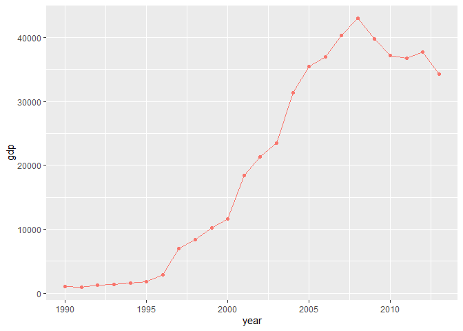

## Loading and Exploring the Data


```r
library(devtools)
```

```
## Loading required package: usethis
```

```r
library(ourworldindata)
library(tidyverse)
```

```
## -- Attaching packages --------------------------------------------------------------------------- tidyverse 1.3.0 --
```

```
## v ggplot2 3.3.2     v purrr   0.3.4
## v tibble  3.0.2     v dplyr   1.0.0
## v tidyr   1.1.0     v stringr 1.4.0
## v readr   1.3.1     v forcats 0.5.0
```

```
## -- Conflicts ------------------------------------------------------------------------------ tidyverse_conflicts() --
## x dplyr::filter() masks stats::filter()
## x dplyr::lag()    masks stats::lag()
```

```r
library(mosaic)
```

```
## Loading required package: lattice
```

```
## Loading required package: ggformula
```

```
## Loading required package: ggstance
```

```
## 
## Attaching package: 'ggstance'
```

```
## The following objects are masked from 'package:ggplot2':
## 
##     geom_errorbarh, GeomErrorbarh
```

```
## 
## New to ggformula?  Try the tutorials: 
## 	learnr::run_tutorial("introduction", package = "ggformula")
## 	learnr::run_tutorial("refining", package = "ggformula")
```

```
## Loading required package: mosaicData
```

```
## Loading required package: Matrix
```

```
## 
## Attaching package: 'Matrix'
```

```
## The following objects are masked from 'package:tidyr':
## 
##     expand, pack, unpack
```

```
## Registered S3 method overwritten by 'mosaic':
##   method                           from   
##   fortify.SpatialPolygonsDataFrame ggplot2
```

```
## 
## The 'mosaic' package masks several functions from core packages in order to add 
## additional features.  The original behavior of these functions should not be affected by this.
## 
## Note: If you use the Matrix package, be sure to load it BEFORE loading mosaic.
## 
## Have you tried the ggformula package for your plots?
```

```
## 
## Attaching package: 'mosaic'
```

```
## The following object is masked from 'package:Matrix':
## 
##     mean
```

```
## The following objects are masked from 'package:dplyr':
## 
##     count, do, tally
```

```
## The following object is masked from 'package:purrr':
## 
##     cross
```

```
## The following object is masked from 'package:ggplot2':
## 
##     stat
```

```
## The following objects are masked from 'package:stats':
## 
##     binom.test, cor, cor.test, cov, fivenum, IQR, median, prop.test,
##     quantile, sd, t.test, var
```

```
## The following objects are masked from 'package:base':
## 
##     max, mean, min, prod, range, sample, sum
```

```r
library(ggrepel)
```


```r
fh <- financing_healthcare %>% 
  filter(!is.na(child_mort)) %>%
  filter(!is.na(continent))

fh2 <- fh %>% 
  filter(!is.na(health_exp_total)) %>%
  select(c(year, country, continent, health_exp_total, child_mort))

fh3 <- fh %>% 
  filter(!is.na(gdp)) %>%
  select(c(year, country, continent, gdp, child_mort))

fh4 <- fh %>% 
  filter(!is.na(health_exp_public)) %>%
  filter(!is.na(health_exp_private)) %>%
  select(c(year, country, continent, health_exp_public, health_exp_private, child_mort))
fh4 <- fh4 %>%
  mutate(more_public = (health_exp_public/health_exp_private) > 1)

fh5 <- fh3 %>%
  filter(continent == "Africa")
```


```r
ggplot(fh2) +
  geom_point(aes(x = health_exp_total, y = child_mort, color = continent))
```

<!-- -->
very clear correlation, not exaclty linear but very strong. Athough spending more than 2000 on healthcare really doesn't seem to have much of an effect, maybe up to 3000.

```r
ggplot(fh3) +
  geom_point(aes(x = gdp, y = child_mort, color = continent))
```

<!-- -->
We see a strong correlation, and we also see that there is some clear seperation in where continents line up. there are some african countries that are deviating pretty strongly though.

```r
ggplot(fh4) +
  geom_point(aes(x = health_exp_public, y = child_mort)) +
  geom_point(aes(x = health_exp_private, y = child_mort))
```

<!-- -->
This graph is not helpful at all. Viewing the adjustments made to fh4, we see that the only instances with both of these to compare in the USA and private is higher in all cases.


```r
ggplot(fh5, aes(x = gdp, y = child_mort, color = country)) + 
  geom_point() +
  geom_line() +
  theme(legend.position = "none")
```

<!-- -->

```r
favstats(fh5$gdp ~ fh5$country)
```

```
##                     fh5$country        min         Q1     median         Q3
## 1                       Algeria  9172.8649  9860.7420 10656.1130 12657.4729
## 2                        Angola  6949.0218  6949.0218  6949.0218  6949.0218
## 3                         Benin  1452.9203  1507.1682  1686.6124  1754.7409
## 4                      Botswana  8099.2633  9095.5247 10535.0721 12513.4846
## 5                  Burkina Faso   821.2261   921.6425  1091.3874  1313.7864
## 6                       Burundi   677.5277   706.6806   717.7072   774.2373
## 7                      Cameroon  2160.4185  2361.2134  2524.2859  2574.0447
## 8                    Cape Verde  1644.3732  2576.8775  3877.9063  5753.1054
## 9      Central African Republic   572.3312   828.2698   851.8636   872.5528
## 10                         Chad   993.0923  1059.5929  1194.0821  1745.1952
## 11                      Comoros  1310.2365  1349.2235  1380.2649  1408.2214
## 12                        Congo  4430.7778  4712.9634  4998.3342  5246.2626
## 13                Cote d'Ivoire  2546.9068  2723.7484  2855.1248  3011.9249
## 14 Democratic Republic of Congo   492.6067   543.3765   604.3794   700.3078
## 15                     Djibouti  2116.5796  2181.1977  2403.2328  2720.1653
## 16                        Egypt  5942.6298  6567.9053  7699.6730  9174.6137
## 17            Equatorial Guinea  1010.3718  2629.7097 19861.6848 36820.1186
## 18                      Eritrea  1096.2148  1389.8971  1545.7598  1675.2192
## 19                     Ethiopia   515.2390   597.6116   646.9448   875.0304
## 20                        Gabon 15309.7691 16957.7715 17542.2534 19145.0524
## 21                       Gambia  1439.2902  1508.8632  1524.1435  1565.7387
## 22                        Ghana  1919.5966  2098.9077  2327.9706  2738.8423
## 23                       Guinea  1042.6792  1091.6989  1161.8518  1190.7462
## 24                Guinea-Bissau  1229.0763  1263.1578  1311.1773  1528.8843
## 25                        Kenya  2140.2891  2186.2514  2236.2496  2394.0038
## 26                      Lesotho  1300.5414  1506.6297  1682.2247  1970.2508
## 27                      Liberia   246.6705   559.1866   664.1518   764.0943
## 28                        Libya 11023.4371 21417.8311 23015.7232 27616.9677
## 29                   Madagascar  1259.4788  1384.5096  1412.6844  1467.6351
## 30                       Malawi   520.6759   590.7596   625.6912   660.0687
## 31                         Mali  1095.6695  1191.6791  1326.1210  1459.4504
## 32                   Mauritania  2639.2141  2729.8559  2828.4504  3327.8905
## 33                    Mauritius  7567.7930  9368.5783 11630.2222 14079.7477
## 34                      Morocco  3853.2581  4222.6011  4817.4664  5942.4941
## 35                   Mozambique   350.9733   437.0109   625.8856   827.8773
## 36                      Namibia  5716.2313  5969.4521  6238.9155  8063.3202
## 37                        Niger   761.8049   785.4282   795.8575   821.4209
## 38                      Nigeria  2739.5872  2831.5023  2983.2067  4568.2935
## 39                       Rwanda   485.8201   794.9249   927.9187  1160.8736
## 40        Sao Tome and Principe  2079.9828  2202.8830  2501.5500  2753.7074
## 41                      Senegal  1737.5885  1835.9891  1942.3733  2154.5392
## 42                   Seychelles 14116.4379 15821.7792 17910.7903 19840.0547
## 43                 Sierra Leone   918.9770  1082.8997  1168.5336  1315.8452
## 44                 South Africa  9546.2504  9886.0295 10288.5066 11940.0994
## 45                  South Sudan  1786.5262  2318.6345  3600.3882  3753.5044
## 46                        Sudan  1753.2607  1963.5776  2351.1264  3097.2679
## 47                    Swaziland  6249.2445  6654.8646  6898.5082  7620.9775
## 48                     Tanzania  1363.3036  1421.5851  1571.2074  1972.6218
## 49                         Togo  1014.1289  1210.6275  1229.2057  1303.0862
## 50                      Tunisia  5677.1308  6509.4738  7924.3842  9859.8128
## 51                       Uganda   773.3517   964.4839  1112.2277  1418.2507
## 52                       Zambia  2006.7495  2102.5947  2274.0650  2789.9957
## 53                     Zimbabwe  1218.4014  1631.3151  2288.9767  2528.6891
##           max       mean          sd  n missing
## 1  13300.6820 11126.3200  1475.24220 24       0
## 2   6949.0218  6949.0218          NA  1       0
## 3   1866.5594  1640.8821   129.89374 24       0
## 4  15002.2601 10904.3625  2071.49182 24       0
## 5   1529.5929  1128.7170   231.15960 24       0
## 6   1073.6267   780.9128   129.14762 24       0
## 7   2768.3226  2471.3221   171.60281 24       0
## 8   6147.9745  3968.3949  1622.68266 24       0
## 9    935.7755   845.4063    67.13804 24       0
## 10  2005.2148  1387.9094   377.39689 24       0
## 11  1531.4613  1387.5437    54.28625 24       0
## 12  5749.1244  5026.6313   377.28173 24       0
## 13  3220.4946  2875.9788   180.18958 24       0
## 14  1267.7065   665.6807   196.54791 24       0
## 15  3112.4350  2470.3771   310.52949 24       0
## 16 10101.5845  7868.7514  1473.12072 24       0
## 17 42972.7507 20181.6854 16073.03216 24       0
## 18  1772.2424  1515.9348   184.61712 20       0
## 19  1330.3728   757.7915   236.03105 24       0
## 20 20548.6141 17924.7942  1488.05670 24       0
## 21  1654.9081  1534.6846    54.54532 24       0
## 22  3833.7905  2509.3703   543.10465 24       0
## 23  1216.3790  1140.6518    58.31336 24       0
## 24  1792.3165  1389.3491   162.57708 24       0
## 25  2747.3849  2316.3038   176.65855 24       0
## 26  2459.1022  1759.4878   339.89613 24       0
## 27   872.8402   623.3054   188.70627 24       0
## 28 29173.6081 23519.7801  4738.88745 15       0
## 29  1660.7263  1425.0039    76.94133 24       0
## 30   764.6989   636.6866    70.85140 24       0
## 31  1534.1621  1320.7579   147.75775 24       0
## 32  3594.5869  2981.0398   316.43812 24       0
## 33 17145.7831 11857.5508  2941.45356 24       0
## 34  7076.1310  5118.1629  1052.49847 24       0
## 35  1033.3070   641.4521   222.60497 24       0
## 36  9142.9121  6910.9853  1149.27764 24       0
## 37   905.6643   809.5034    39.65285 24       0
## 38  5447.7592  3667.9955  1010.60964 24       0
## 39  1516.2926   988.6466   267.21547 24       0
## 40  2963.2334  2492.4755   318.79189 14       0
## 41  2192.9827  1976.6985   162.36240 24       0
## 42 24805.2415 18176.6035  2856.85618 24       0
## 43  1832.7486  1214.4232   200.68576 24       0
## 44 12454.1909 10739.8369  1071.69234 24       0
## 45  3793.9623  3079.5319   951.63899  6       0
## 46  3847.1675  2536.6307   648.43824 24       0
## 47  7835.6689  7029.8566   527.17621 24       0
## 48  2335.9633  1700.4699   321.12285 24       0
## 49  1417.7982  1248.9816    82.01237 24       0
## 50 10730.8911  8124.2665  1725.59684 24       0
## 51  1665.8094  1175.3258   296.11764 24       0
## 52  3623.2349  2501.9088   514.45913 24       0
## 53  2680.9642  2067.1871   507.82390 24       0
```

```r
fh5 %>%
  filter(country == "Equatorial Guinea") %>%
  ggplot(aes(x = year, y = gdp, color = country)) + 
  geom_point() +
  geom_line() +
  theme(legend.position = "none")
```

<!-- -->


## Visualization for Presentation


```r
fh6 <- fh %>%
  filter(year >= 1900) %>%
  group_by(year, continent) %>%
  summarise(child_mort = sum(child_mort))
```

```
## `summarise()` regrouping output by 'year' (override with `.groups` argument)
```

```r
label_points <- fh6 %>%
  group_by(continent) %>%
  filter(row_number(desc(year)) == 1)
  
ggplot(fh6, aes(x = year, y = child_mort, color = continent)) + 
  geom_point() +
  geom_line() +
  theme(panel.background = element_blank(),
         plot.background = element_blank(),
         legend.position = "none",
         panel.grid.major.y = element_line(color = "grey88", linetype = "dashed"),
         axis.title = element_blank()) +
  geom_label_repel(data = label_points, aes(label = continent)) +
  labs(title = "Declining Child Mortality Across Continents",
       x = "Year")
```

<!-- -->

The key here is that there is definitely a convergence of child mortality, while Europe have had low child mortality for a long time, everywhere else is dropping significant. Even Africa, where child mortality is the worst, is currently better than anywhere else except Oceana, were a year ago. We also see the most dramatic improvements in the higher mortality countries.


